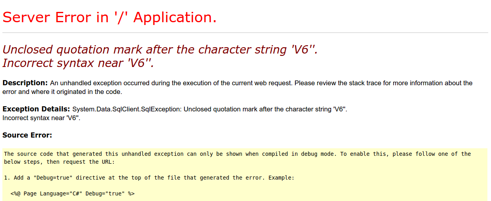

# Security Module

### Summary
Learn by going on the offensive! For this module we will be hacking a website [http://hackyourselffirst.troyhunt.com/](http://hackyourselffirst.troyhunt.com/) created by Troy Hunt. It's an intentionally vulnerable web app for practicing web security fundamentals. Open the web app and have a look around. Sign up for an account.

## SQL Injection

### Exploits in this Section
1. Not scrubbing user input before inserting it into SQL command
1. Leaking error messages
1. Storing cleartext passwords


### Identifying the risk
- [ ] Go to the bottom of the home page where it says "Cylinder layouts". Click a couple of the buttons below and observe the resulting URLs.

```
http://hackyourselffirst.troyhunt.com/CarsByCylinders?Cylinders=V6
http://hackyourselffirst.troyhunt.com/CarsByCylinders?Cylinders=V8
http://hackyourselffirst.troyhunt.com/CarsByCylinders?Cylinders=V12
```
Notice that a query string is used to tell the server which cylinder layout is being requested. It's very likely that the value of this query string is being interpolated into a SQL query, like this.
```sql
SELECT * FROM supercar WHERE cylinders = 'V6';
```
We can test this by trying to trigger an error. If we can trigger a SQL syntax error, that means the query string is inserted and we have the ability to inject SQL queries. Perhaps the "V6" is ending up between a pair of single quotes, as it *should* be a SQL string.

- [ ] Expose a SQL injection vulnerability by inducing a SQL syntax error. Edit the URL by altering the query string and re-visiting the page.
- [ ] A conspicuous error message will appear if it is right.

*How will we know when an error is triggered?*

Some frameworks have predictable error handling. If we inspect the "network" tab in the Chrome DevTools and look at the HTTP request for this HTML page, we'll find an interesting header: `X-Powered-By: ASP.NET`. This means the server is running `ASP.NET`. When this framework gets errors in an HTTP request, instead of the usual web page, it generates a response that looks like this:

You should see something like this once you've triggered an error.

### SQL tautology
Now let's inject some purposeful SQL. We'll use a SQL tautology. These are expressions that are *always true* because they are redundant `1 = 1` or `'x' = 'x'`. When combined with logical operators `OR` and `AND` these can be used in malicious ways to negate other boolean expressions. This page is showing the cars with a V6 cylinder layout. Let's see if we can get the page to show ALL the cars, regardless of cylinders. See if you can utilize a tautology to craft a WHERE clause that will *always* be true.

### Schema discovery
Navigate to this url: `http://hackyourselffirst.troyhunt.com/CarsByCylinders?Cylinders=V6' AND 1=(SELECT * FROM foo);--`
This is getting interpolated to something like this:
```sql
SELECT * FROM supercar WHERE cylinder = 'V6' AND 1=(SELECT * FROM foo);--';
```
The double hyphen at the end is a SQL comment. It comments out the rest of the SQL to avoid extraneous quotes. The single quote after `V6` is closing the string, followed by an `AND` and a second expression. Within the parenthesis is an **inner query**. In SQL you can nest queries. The result of the inner query is placed within the outer query. Using an inner query lets us execute arbitrary SQL. Visiting this page will tell us `Invalid object name 'foo'`. This is a helpful error message because it confirms the lack of a table named "foo". What if we replace "foo" with "supercar"? The error message will be different. This is because the inner query succeeded, telling us that the "supercar" table exists. In fact it returned several rows and placed the result in the outer query and tried to compare it to `1`. The error is from trying to compare a single integer to a bunch of rows. Using this method, we can brute force the rest of the table names if we wanted to (but don't do that just yet).

### Password stealing
Let's start stealing passwords. First we'll need to find out the table name. Here are some sensible names to try:
```
user
users
profile
profiles
userprofile
account(s)
```
Once we have the table name for our users, we can try to get some password. Using an inner query we can run arbitrary commands. However, we also need to visualize the result. The structure of the outer query may limit our ability to see our results. We know that the result of the inner query will get compared to the number 1. If we have multiple values, we'll get a vague error message. It doesn't actually show the results from the inner query. But what if the result of the inner query is a single value?

```sql
SELECT * FROM supercar WHERE cylinder = 'V6' AND 1=(SELECT TOP 1 cylinders FROM supercar);--';
```
`TOP 1` will limit the results to one row. We are also only selecting one column "cylinders". This is a single value (the string "V6") so it actually makes sense to try to compare it to the value 1! The following error message is displayed: `Conversion failed when converting the nvarchar value 'V6' to data type int.` It tried to convert "V6" to an integer and it actually showed us the value in the error message! Perhaps we can do something similar with a user's password.

- [ ] Craft an inner query to obtain a random user's password
- [ ] Exchange emails (that you used to register with this app) with another group and try to obtain one another's passwords.

#### Counter-measures
Remember to escape (a.k.a. scrub) the user's input before querying the DB. There are libraries dedicated to this. Furthermore, using an ORM will prevent malicious SQL injections to make it to the DB.

## Session Hijacking

### Exploits in this Section
1. Not escaping user input before placing it on web page
1. Cross-site scripting (XSS)
1. Not setting cookie to HttpOnly


### Identifying the risk
On the home page there is a search bar. Try typing in a query. If, for example, we search "hello", we will be directed to the `/Search` path. The URL will also have a query string that contains "hello". Furthermore, the page will say `You searched for "hello"`. So the user input ends up in the query string and subsequently in the DOM. In fact, let's find the code that is placing our input to the DOM. Open the DevTools' Elements tab. At the bottom of the `<body>` is two script tags. One of these tags contains the jQuery code that is placing "hello" in the DOM.

```javascript
$('#searchTerm').val('hello');
```

Let's try to inject some JavaScript here. Can we get some arbitrary code in here?

- [ ] See if you can trigger an `alert` by typing a search query.
- [ ] Once you see an alert, copy that URL containing your malicious code and have one of your cohort mates visit that link. See if it triggers an alert for them. (if someone sends YOU a link please participate, we've got nothing to lose here)

### Stealing the cookie

The danger in allowing JavaScript on the page is the potential to steal their cookie. JavaScript can run `document.cookie` on a page to read it. Ideally, this should be for YOUR EYES ONLY. If an attacker can execute JavaScript on other people's pages, they can get your cookie and send it to some other server (potentially theirs) via HTTP. Once they have your cookie they are essentially YOU.

- [ ] Write a query that reads the user's cookie and sends it as a message to the `unit-project-slack` message API in an AJAX post request. `http://slack-server.elasticbeanstalk.com/messages`
- [ ] Send your link to a cohort mate and then GET the messages from the API to retrieve the cookie that was just stolen.
- [ ] Set their cookie to your browser and gain access to their account

#### Counter-measures
Remember to escape user input before placing it in the DOM. Using the "HttpOnly" option when setting the cookie will prevent it from being read with `document.cookie`.


## Priveledge Escalation

### Exploits in this Section
- [ ] Mass assignment
- [ ] Accepting "untrusted data"

### Identifying the risk

Many websites have users with different access privileges. Usually there are some "admin" users. One way to implement this is to have a column in the users table called `admin` which is a boolean. If vulnerable, an attacker can set this to "true" and gain undue access to the website's admin features.

- [ ] Under "My account" click "Edit profile"

Here we see a form that allows us to ultimately change our first and last name in the database. It posts to a route on the server. But can we use this post route to edit the "admin" field to true? Edit your name to something else and then use the DevTools to see the HTTP request used to change that information. For example, the URL to edit my info was:
```
http://hackyourselffirst.troyhunt.com/Account/UserProfile/46
```
Apparently my userid is 46. You should be able to achieve the same editing capability without the form. Get all the info you need from the DevTools to recreate the POST request from scratch.

- [ ] Using either the command line or Chrome's "Postman" app, recreate this post request to edit your name once more
- [ ] Add another field to the request body `isAdmin: true`
- [ ] See if anything is different

#### Counter-measures
Do not let unexpected parameters to enter the database query. Only "firstName" and "lastName should be allowed".
